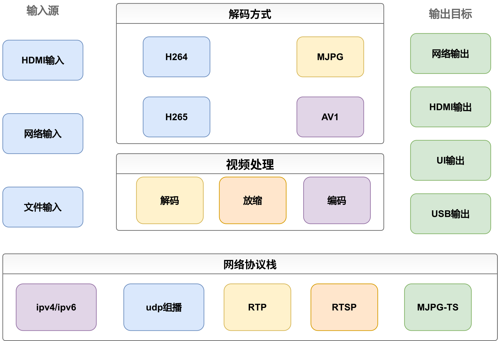
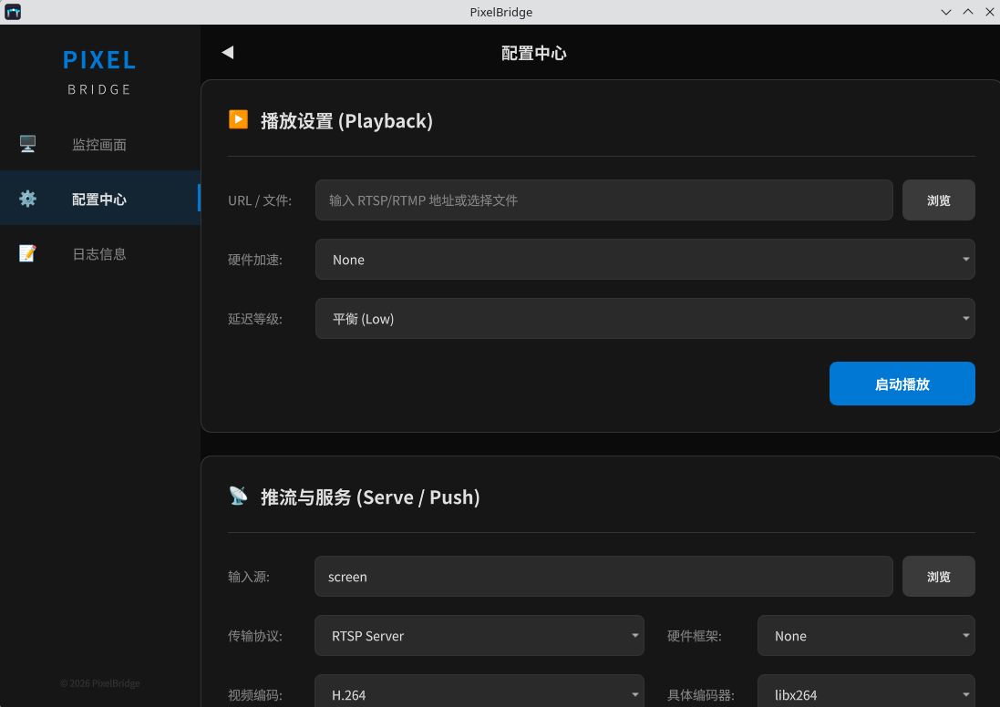

# PixelBridge

PixelBridge 是一个基于 Qt6 + FFmpeg + live555 的流媒体处理与播放工具，同时也是 2025 大创项目《基于嵌入式网络的多媒体教室屏幕同传系统的设计与实现》的应用端实现。

核心目标是高效视频推拉流和高效编解码，支持多种输入输出协议（文件、RTSP、UDP、RTP）以及多种硬件加速路径（由 FFmpeg 与硬件驱动能力决定），并提供低延迟屏幕采集与本地预览能力。

软件主要面向嵌入式 ARM 设备（树莓派 4/5、Jetson Nano/Xavier NX、RK3588 等），同时兼容 x86 Linux、Windows，以及 arm64 macOS。

## 系统架构



## 界面展示



## 功能概览

- 本地预览：在 QML 界面实时显示视频。
- 播放模式（Play）：拉取本地文件、RTSP、UDP、RTP 并解码预览。
- 推流模式（Push）：将输入源转码后推送到 udp、rtp、rtsp。
- 服务模式（Serve）：将输入源编码后通过内置 RTSP Server 对外发布。
- 屏幕采集：支持 screen:index 形式采集屏幕。
- 硬件加速：支持通过 FFmpeg 硬件设备类型选择硬件解码/编码（如 cuda、vaapi、qsv 等，取决于平台）。
- 低延迟策略：提供 UltraLow / Low / Standard 三档延迟等级。

## 支持列表

| 架构           | 系统    | 获取方式         |
| -------------- | ------- | ---------------- |
| x86_64         | windows | zip              |
| x86_64         | linux   | AppImage deb rpm |
| x86_64         | android | 自行编译         |
| arm64          | windows | 自行编译         |
| arm64          | linux   | 自行编译         |
| arm64          | android | 自行编译         |
| arm64          | macos   | dmg              |
| x86_i686/arm32 | -       | 自行编译         |

## 项目结构

```text
PixelBridge/
├── include/               # 核心接口与过滤器头文件
├── src/                   # 核心实现
│   ├── core/              # Bridge、Logger
│   └── filters/           # Demuxer/Decoder/Encoder/Muxer/RTSP/ScreenCapture
├── qml/                   # UI 页面（显示、配置、日志）
├── thirdparty/live555/    # 内置 live555 源码（CMake 包装构建）
├── scripts/               # 打包脚本（AppImage / Windows MSYS2）
├── CMakeLists.txt
├── CMakePresets.json
└── VERSION
```

## 核心架构说明

### 1) Filter 链模型

系统采用可串联过滤器链：

Source -> Demux/ScreenCapture -> VideoDecoder -> (Tee) -> VideoEncoder -> Muxer/RTSP

- Bridge 负责创建和销毁链路，并通过互斥锁保护并发切换。
- stopAll 会先停源头，再逆序停止后续节点，降低阻塞与析构风险。
- 开启 Echo（本地回显）时，TeeFilter 会把解码帧同时分发到本地预览与编码链路。

### 2) 数据包抽象

- AVPacketWrapper：封装编码包。
- AVFrameWrapper：封装解码帧。
- 各过滤器通过统一 DataPacket 接口传递数据。

### 3) 延迟等级

- UltraLow（0）：极致低延迟，可能牺牲稳定性。
- Low（1）：平衡模式（默认）。
- Standard（2）：优先稳定与画质。

该等级会影响 Demuxer 探测参数、Decoder 线程策略、Encoder GOP 与预设、Muxer 缓冲与 flush 方式，以及 ScreenCapture 队列深度。

## 依赖要求

### 编译依赖

- CMake >= 3.14
- C++20 编译器
- Ninja（推荐）
- **Qt 6.5 或更高版本**：Core、Gui、Qml、Quick、QuickControls2、Multimedia
- FFmpeg：avformat、avcodec、avutil、avdevice、swscale
- OpenSSL
- spdlog
- Threads

说明：live555 以 git submodule 形式随仓库提供，CMakeLists.txt 会在首次 configure 时自动执行 `git submodule update --init`。也可手动运行：
```bash
git submodule update --init --recursive
```

## 构建

### Linux / macOS

```bash
cmake --preset release
cmake --build --preset release -j
```

产物路径：build/release/PixelBridge

### Windows（MSYS2 UCRT64）

```bash
cmake --preset ucrt64
cmake --build --preset ucrt64 -j
```

### Android（arm64-v8a）

前提条件：
- Android SDK（API 26+）
- Android NDK r26（`ndk;26.3.11579264`）
- Qt 6.5.x for Android（`android_arm64_v8a`）+ Qt 6.5.x for Linux host（`linux_gcc_64`）
- [vcpkg](https://github.com/microsoft/vcpkg)（用于获取 FFmpeg、OpenSSL、spdlog 的 Android 交叉编译版本）
- Java 17+、Ninja

```bash
# 1. 安装 Android 交叉编译依赖（通过 vcpkg）
export ANDROID_NDK_HOME=/path/to/ndk/26.3.11579264
vcpkg install \
  "ffmpeg[core,swscale,avdevice,avformat,avcodec,avutil]:arm64-android" \
  "openssl:arm64-android" \
  "spdlog:arm64-android"

# 2. 配置（将路径替换为实际安装位置）
cmake -B build/android \
  -G Ninja \
  -DCMAKE_TOOLCHAIN_FILE=/path/to/vcpkg/scripts/buildsystems/vcpkg.cmake \
  -DVCPKG_TARGET_TRIPLET=arm64-android \
  -DVCPKG_CHAINLOAD_TOOLCHAIN_FILE=$ANDROID_NDK_HOME/build/cmake/android.toolchain.cmake \
  -DANDROID_ABI=arm64-v8a \
  -DANDROID_PLATFORM=android-26 \
  -DANDROID_STL=c++_shared \
  -DQT_HOST_PATH=/path/to/Qt/6.5.x/gcc_64 \
  -DCMAKE_PREFIX_PATH=/path/to/Qt/6.5.x/android_arm64_v8a \
  -DCMAKE_BUILD_TYPE=Release \
  -S .

# 3. 编译共享库
cmake --build build/android --parallel

# 4. 打包 APK
cmake --build build/android --target apk
```

产物路径：`build/android/android-build/build/outputs/apk/`

> **注意**：屏幕采集（`screen:` 输入源）在 Android 上不可用。原因是 **Qt6 Multimedia 的 `QScreenCapture` 类没有 Android 后端实现**，该类目前仅支持 Windows / Linux（X11 或 Wayland via PipeWire）/ macOS。在 Android 上捕获屏幕需要调用系统级的 `MediaProjection` API，并弹出用户授权对话框，Qt 的跨平台抽象层尚未封装此流程。其余功能（播放 RTSP/文件、推流、内置 RTSP Server）均正常工作。

## TODO List

- [ ] windows MSVC支持。
- [x] Android 支持（MVP: Play/Push/Serve 可用；屏幕采集暂不支持，原因：Qt6 `QScreenCapture` 没有 Android 后端）。
- [ ] 界面优化,增加更多配置选项。
- [ ] RTMP支持。
- [ ] 音频传输支持。

## 许可证

本项目采用 MIT 许可证，详见 LICENSE。
